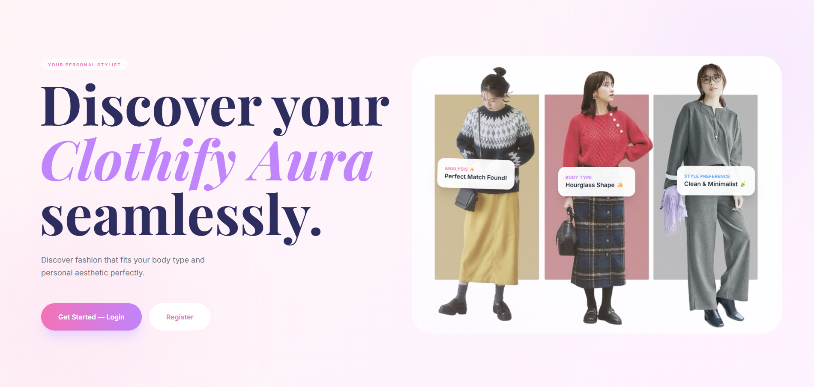
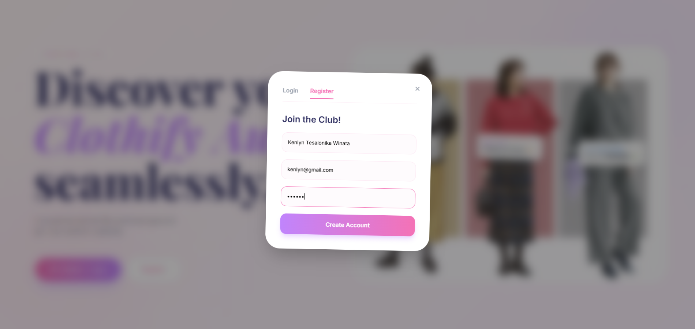
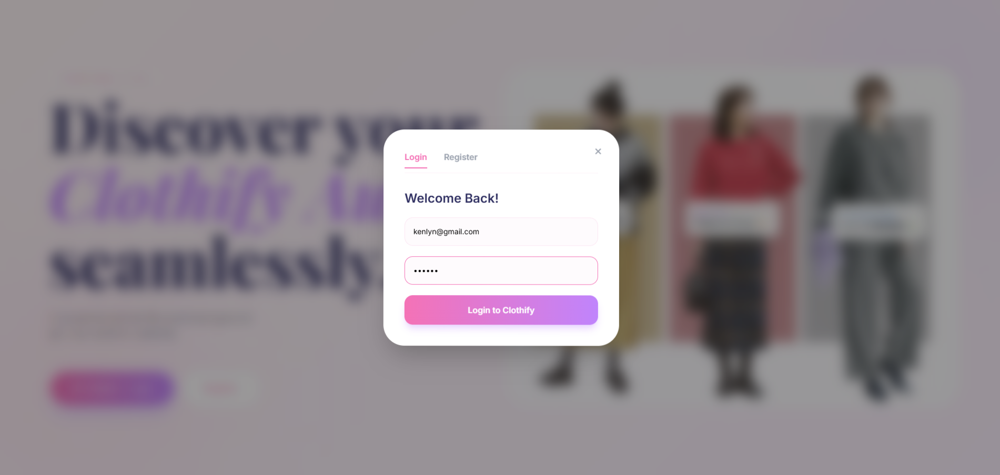
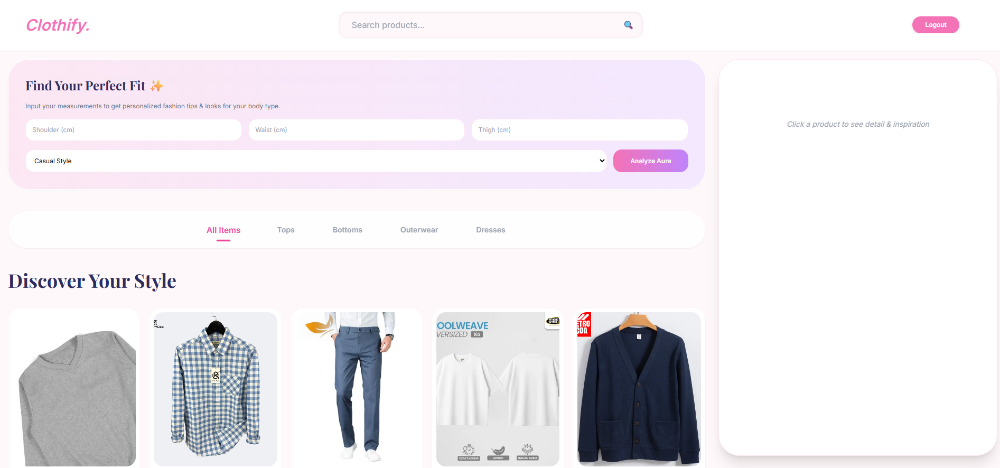
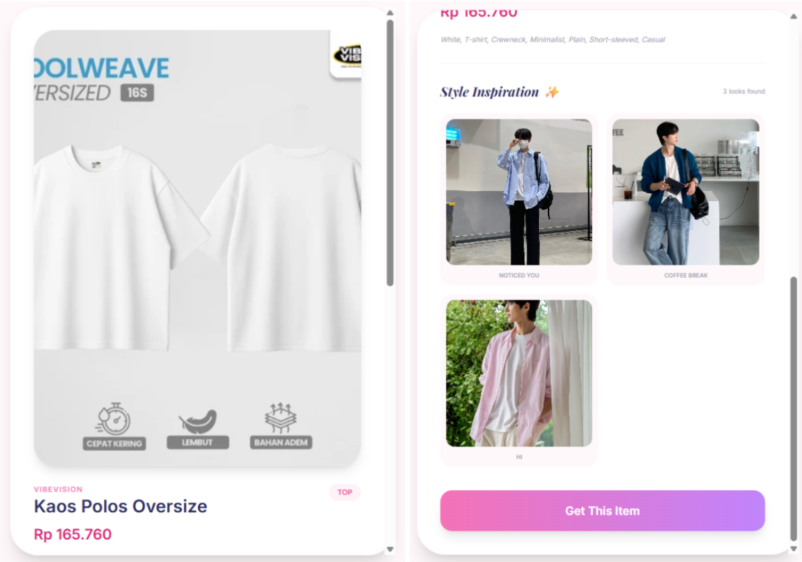

# Clothify: Fashion Catalog System

Merupakan layanan berbasis web yang dikembangkan menggunakan CodeIgniter 4 dan di-deploy di sebuah STB kelompok. Layanan ini menyediakan katalog produk fashion yang **terintegrasi dengan Inspirasi: Inspirations-to-E-commerce Fashion System** untuk mendapatkan inspirasi outfit dari sebuah produk sehingga pengguna akan mendapatkan gambaran dari pemakaian product dan mendapatkan inspirasi mix-match itemnya.

- - -

## Teknologi yang Digunakan

- **Framework**: CodeIgniter 4
- **Database**: SQLite
- **Deployment**: Docker STB
- **Bahasa Pemrograman**: PHP, HTML, CSS, JavaScript
- **Pendekatan Arsitektur**: Microservices

- - -

## Dokumentasi API

Berikut adalah linknya: [clothify.otwdochub.my.id](https://clothify.otwdochub.my.id)

Fashion Catalog System menyediakan layanan berbasis API yang dirancang untuk mendukung kebutuhan pengelolaan dan pencarian katalog fashion. Adapun endpoint yang tersedia pada sistem ini yaitu sebagai berikut:
- **GET /products**: digunakan untuk menampilkan daftar produk fashion.
- **GET /products/{id}**: digunakan untuk mengambil detail produk berdasarkan ID tertentu.
- **GET /products/search**: digunakan untuk mencari produk berdasarkan kategori atau tags tertentu.
- **GET /products/categories**: digunakan untuk menampilkan daftar kategori yang ada.
- **GET /products/tags**: digunakan untuk menampilkan daftar tag yang ada.
- **GET /products/recommendations**: digunakan untuk memberikan rekomendasi produk berdasarkan tag, body type, dan style.
- **GET /products/recommend**: digunakan untuk memberikan rekomendasi produk berdasarkan parameter body type dan style yang akan dibantu oleh pengimplementasian AI.
- **POST /products**: digunakan untuk menambahkan produk baru. Endpoint ini hanya dapat diakses oleh admin melalui Postman dengan menambahkan header `x-api-key` bernilai `admin-123`. Berikut adalah struktur dari datanya:
```json
{
  "id": 32,
  "name": "Mini Dress Biru",
  "category": "dress",
  "tags": "Biru, Midi-Dress, Mini-Dress, Feminine",
  "color": "blue",
  "style": "clean, casual, smart",
  "price": 213000,
  "product_url": "https://id.shp.ee/6oeWp5s",
  "image_url": "https://down-id.img.susercontent.com/file/id-11134207-7rasa-m0ke6x5crnpo50@resize_w450_nl.webp",
  "brand": "Riona",
  "gender": "woman",
  "created_at": "2026-01-03 07:58:58"
}
```

## Cara Mengakses Layanan

Pengguna dapat mengakses layanan Clothify melalui website yang telah dideploy. Berikut merupakan alur penggunaannya:

- Pengguna mengakses website Clothify melalui tautan berikut:  
  **Clothify Website**: https://clothifyfashioncatalogservicesuasts.vercel.app
  

- Pada halaman awal (Landing Page), pengguna dapat melakukan **registrasi** untuk membuat akun baru.
  

- Setelah registrasi berhasil, pengguna dapat melakukan **login** menggunakan akun yang telah dibuat.
  

- Setelah login, pengguna akan diarahkan ke **halaman utama Clothify** yang menampilkan katalog produk fashion.
  

- Pengguna dapat:
  - Melihat daftar produk fashion yang tersedia
  - Melakukan pencarian produk melalui *search bar*
  - Memfilter produk berdasarkan kategori

- Pengguna dapat mengklik salah satu produk untuk melihat **detail produk**, yang mencakup informasi produk serta inspirasi outfit yang terintegrasi dari **_Inspirations-to-E-commerce Fashion System_**.
  

- Pada halaman detail produk, pengguna dapat menekan tombol **“Get This Item”** untuk diarahkan ke halaman pembelian produk pada platform e-commerce terkait.

- Pengguna dapat keluar dari sistem dengan menekan tombol **Logout** yang tersedia pada bagian kanan atas halaman.
